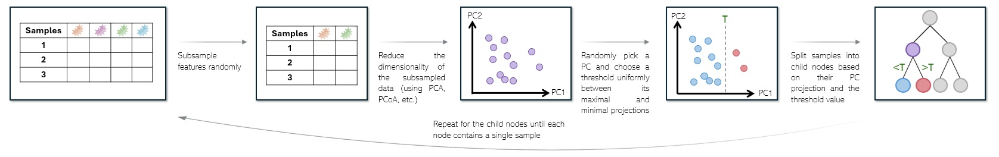

# How to run KADAIF?

# Overview

The KADAIF algorithm is an anomaly detection method specifically designed for microbiome data. It is based on the concept of [Isolation Forest (liu et al., 2008)]([url](https://ieeexplore.ieee.org/abstract/document/4781136)), a tree-based unsupervised learning algorithm that isolates anomalies by recursively partitioning data.
The anomaly score is computed based on how the average depth on which a sample was isolated.



# Running KADAIF


## Parameters
* **`number_of_trees`** (int, default=100): The number of isolation trees to create.
* **`trees`** (list, default=None): A list of pre-existing trees; if None, a new set of trees is created.
* **`min_samples_to_split`** (int, default=2): The minimum number of samples required to allow a split in a tree.
* **`max_depth`** (int, default=100): The maximum depth of each tree.
* **`weights`** (str, default="equal"): Weighting scheme for feature selection. Options: "equal" (all features are drawn over a uniform distribution), "proportion" (draw feature according to their mean abundance), or "None" (use all the features).
* **`replacement`** (bool, default=True): Whether to sample with replacement during feature selection.
* **`pc_method`** (str, default="proportion"): The method for selecting principal components. Options: "first" (use the first PC), "equal" (choose from the first few  PCs over the uniform distribution), "proportion" (choose from the first few PCs with probablity proportional to the variance explained).
* **`normalize`** (bool, default=True): Whether to normalize selected features.
* **`subsample_size`** (int, default=100): Number of features selected at each split.
* **`splitting_method`** (str, default="pcoa"): Method used for splitting. Options: "pcoa", "unifrac_unweighted_pcoa", "unifrac_weighted_pcoa" or "pca".
* **`paral`** (bool, default=True): Whether to parallelize tree building.
* **`cpu`** (int, default=None): Number of CPU cores used for parallelization. If None, all available cores are used.
* **`verbose`** (bool, default=True): Whether to print progress messages.
* * **`unifrac_tree`** (skbio TreeNode, default=None): a phylogenetic tree in scikit-bio TreeNode format with tips corresponding to taxa in features_matrix. needed only if "splitting_method" is "unifrac_unweighted_pcoa" or "unifrac_weighted_pcoa".

## Methods

**`fit(features_matrix)`**
Trains KADAIF on the given feature matrix.
* **features_matrix (pd.DataFrame)**: A feature matrix where rows represent samples and columns represent features.
* **Returns: None.**

**`score()`**
Computes the anomaly scores for the dataset.
* **Returns: None.** The anomaly scores are stored in self.scores.

**`fit_transform(features_matrix)`**
Fits the model and computes anomaly scores in one step.
* **features_matrix (pd.DataFrame)**: Input feature matrix.
* **Returns: numpy.array**. An array of anomaly scores corresponding to input samples.

# Usage Example

```python
import pandas as pd
from KADAIF import KADAIF

# Load example dataset
data = pd.read_csv("microbiome_data.csv", index_col=0)

# Initialize model
model = KADAIF(number_of_trees=50, subsample_size=50)

# Fit and transform
anomaly_scores = model.fit_transform(data)
```
